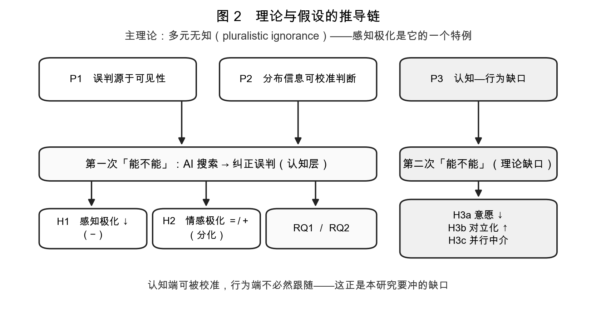
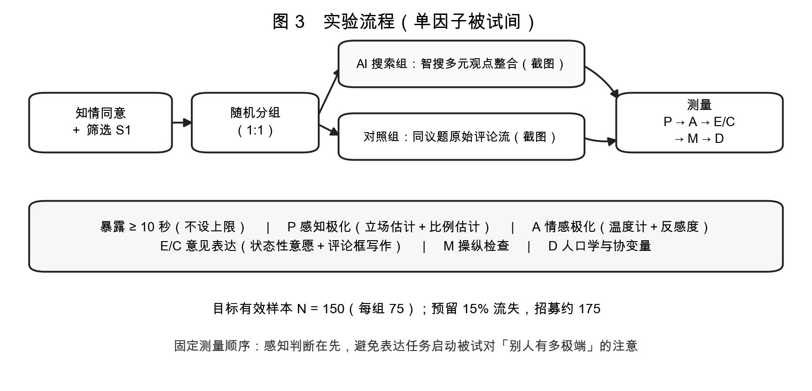
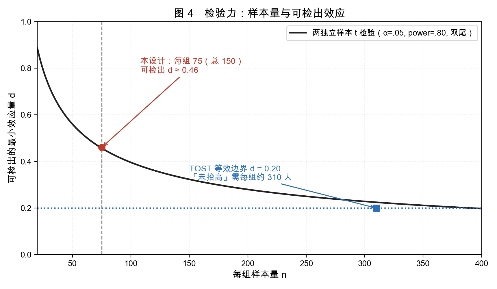

# 研究设计

- 记录日期：2026-09-23
- 更新日期：2026-10-05（补齐可执行细则）
- 课程：传播学
- 状态：设计已定型 —— **单因子两组被试间实验**；可执行细则已补齐
- 关联文件：`选题.md`（选题演进与理论资源）、`理论框架与假设.md`（理论推导与假设）、`文献框架.md`（文献与术语）、`模型图.png`（模型图）

> 本文件是**方法与设计的完整版**，可独立阅读。与 `选题.md` 第七节一致，并补齐了分析策略与效度局限。
>
> **完整版 Word**（本文件 ＋ 下列两份执行层文件）由 `tools/build_report.py` 合并导出：
>
> ```bash
> python3 tools/build_report.py 研究设计-完整版.docx
> ```

**执行层配套（本文件只留取舍与依据；题项、代码、模板分别在下列三份文件）**

| 文件 | 内容 |
| --- | --- |
| `测量工具.md` | 问卷题项全文、计分表、两套编码手册、伦理与知情同意 |
| `预注册与分析.md` | 预注册模板、检验力参数、判定规则、SPSS/PROCESS 操作 |
| `tools/analysis_pipeline.py` | 可复现分析流水线（`--simulate` 无数据也能跑通） |

## 一、题目与研究问题

**题目**

> AI 能成为舆论"降温器"吗？——AI 搜索对感知极化与意见表达的影响研究（以微博智搜为例）

提问式主标题须保持**开放提问**；因现有实证证据的主流结局为**无效应或逆火**，正文必须正面呈现"降温"与"升温"两条证据线，避免被读成预判结论。

**主研究问题（统摄）**

> AI 搜索能否缓解舆论场中的多元无知，并将这一认知纠正传导为意见表达的改变？

此问含两次"能不能"：

1. **第一次**：AI 搜索 → 纠正误判（认知层）
2. **第二次**：纠正误判 → 改变表达（行为层，**理论缺口所在**）

| 编号 | 研究问题 | 对应假设 |
| --- | --- | --- |
| **RQ1**（矫正｜核心） | AI 搜索是否降低感知极化？ | H1 |
| **RQ2**（分化｜核心） | 它在降低感知极化的同时，是否抬高情感极化？ | H2 |
| **RQ3**（外溢） | 感知极化的降低，是否进一步改变意见表达？ | H3a／H3b／H3c |

> 原 RQ4（边界条件）已随调节变量一并撤销——本设计不设调节变量。

## 二、理论框架与推导起点

**主理论：多元无知**（pluralistic ignorance）。群体成员系统性地误判他人的态度与立场；经典表述为"没有人相信，但每个人都认为每个人都相信"。

**关键判断**：感知极化是多元无知的一个**特例**（Asami & Kishishita 2025 把 false polarization 定为 "unilateral ignorance"）。

**三个推导命题**

| 命题 | 内容 | 出处 |
| --- | --- | --- |
| **P1　误判源于可见性** | 对意见气候的判断依赖可见线索；分布不可见时，判断朝同一方向系统性偏离 | Prentice & Miller 1993；Miller 2023 |
| **P2　分布信息可校准判断** | 暴露于更完整的意见分布信息，可校正该判断 | Sparkman et al. 2022；Bursztyn et al. 2020 |
| **P3　认知—行为缺口** | 判断的校正不必然传导为行为改变，此为既有研究的未决环节 | Miller 2023；Geiger et al. 2025；Vlasceanu et al. 2024 |



## 三、模型与假设

```
AI 搜索（有 vs 无）
   │
   ├── H1 ──→ 感知极化（认知）── H3a ／ H3b ──┐
   │                                           ├──→ 意见表达
   └── H2 ──→ 情感极化（情感）───── H3c ──────┘    意愿 ／ 对立化程度

H3c：感知极化与情感极化并行中介"AI 搜索 → 意见表达"
```

（配图见同目录 `模型图.png`）

| 编号 | 假设 | 方向 | 推导自 |
| --- | --- | --- | --- |
| **H1** | AI 搜索（vs 无 AI 搜索）显著降低感知极化 | − | P1＋P2 |
| **H2** | AI 搜索不降低、甚至抬高情感极化；二者变化方向分离 | ＝／＋ | P2 的适用边界 |
| **H3a** | 感知极化降低意见表达意愿 | − | P3 |
| **H3b** | 感知极化提高表达的对立化程度 | ＋ | P3 |
| **H3c** | 双中介并行；情感中介**削弱（但不必然反转）**认知中介的负向间接效应 | 结构 | P3 |

## 四、核心概念的界定与操作化

| 概念 | 界定 | 操作化 |
| --- | --- | --- |
| **AI 搜索**（自变量） | 智搜在争议议题下对多种立场观点的聚合与并列呈现 | 两组：AI 搜索条件 vs 平台原始评论流（对照） |
| **感知极化** | 用户对"对立阵营实际立场"的主观估计中，超出真实分布的那部分 | ① **立场位置**：自我立场放置 ＋ 对典型支持方／反对方的位置估计（7 点）；主指标 `感知极化 = abs(感知差距)`，另算偏差 `= 感知差距 − 实际差距`（来源见下）<br>② **比例估计**：对支持／反对方各占多少比例的估计（0–100），与真实分布相比（对接 Sparkman et al. 2022 的经典操作） |
| **情感极化** | 用户对持对立立场群体的反感程度 | 感受温度计（0–100）＋ 对"家人持对立立场"的不适感 |
| **意见表达意愿** | 用户在争议议题上公开表达自身立场的意愿，及其表达的对立化程度 | **状态性测量**（"这个话题下，你现在有多愿意公开说出看法？"1–7，共若干题）＋ 准行为任务（评论框写作并编码：写不写、字数、对立化程度） |

**计分与基准（题项全文见 `测量工具.md` 第二、三节）**

| 变量 | 算法 | 说明 |
| --- | --- | --- |
| 感知极化 `perceived_gap` | `abs(P_sup − P_opp)` | 主指标；P 为 1–7 立场位置估计 |
| 感知偏差 `perceived_bias` | `perceived_gap − actual_gap` | 次要指标，需真实分布基准 |
| 情感极化 `affect_out` | A3（对对立立场者的反感，0–100） | 主指标；A1−A2 温差为次要 |
| 意见表达意愿 `willingness` | E1–E3 均值 | 报 Cronbach's α |
| 表达对立化 `incivility` | C1 文本的编码等级（0–4） | 见 `测量工具.md` 编码手册 B |

**「实际差距」的来源（原稿未交代，必须补）**：`actual_gap` 不能来自被试自身，须取自 ① 第一步内容分析对同议题评论流的立场编码，或 ② 一次小规模基线样本。两点须写进正文：该基准是**可见评论**的分布而非全体网民分布，其偏差正是多元无知的机制（P1），应指出而非掩盖；且因基准对全体是常数，H1 用 `perceived_gap` 或用 `perceived_bias` 得到的**组间比较完全相同**，减基准的意义只在让"偏差"可与 Sparkman et al. 2022 直接对话。

**三点必须写进正文的说明：**

1. **本土化**：false polarization 的经典测量建立在党派之上，中国语境无对应物，须改用**议题立场群体**（"支持方／反对方"）替代。这既是方法挑战，也是本研究的本土化贡献点。
2. **构念不对称**：感知极化测的是「**感知偏差**」（估计 vs 实际），情感极化测的是「**自身态度**」（自己有多反感）。一个在感知层、一个在态度层，不点明会被追问"为何拿感知与态度比"——而这正是"分化效应"的立意所在。
3. **不使用 WTSC**：Hayes et al. (2005) 的自我审查量表是**稳定特质**（4 周重测 r=.67），一次暴露改变不了它，不适合做因变量。

## 五、刺激材料：第一步（小规模内容分析）

**定位：干预定型（intervention formative）** —— 不企图做成发表级内容分析，目标只是**为实验确定刺激材料**。定位准确，体量才合理。

| 项目 | 内容 |
| --- | --- |
| **抽样** | 3–4 个争议议题，在智搜下观察输出并截图存档；挑选标准是"智搜会触发多元整合的高争议议题" |
| **编码框架** | 立场配比（单边／双边／多边）｜呈现结构（并列／分层／叙事融合）｜议题框架（冲突／责任／人情／道德）｜语气强度｜是否附真相分布｜署名标注 |
| **产出** | 一份可复用的刺激材料库 ＋ 各维度取值依据 |

> 编码框架中的"是否附真相分布""署名标注"等维度**仅作观察记录**，已不作为实验因子。

**刺激材料的制作规格（把"同等信息量"这一承诺落成可核查的标准）**

| 项目 | 规格 |
| --- | --- |
| 截图 | 同一机型／同一 App 版本／同一显示模式；分辨率一致，仅保留材料相关区域 |
| 信息量 | 两组**观点条数相同**（建议各 8–10 条）、**总字数差 ≤ 10%** |
| 去混淆 | 抹掉点赞数、转发数、时间戳等互动数据，使两组除"呈现形式"外无信息差 |
| 存档 | 原始截图 ＋ 材料说明书（条数、字数、编码取值）一并留作论文附录 |

> 注意操纵的是**呈现形式**（智搜整合摘要 vs 评论流），不是内容量；两组必须讲同一议题、给同等多的观点。

## 六、实验设计：第二步

**设计：单因子被试间 —— AI 搜索（有 vs 无）**

理由：主研究问题问的是"AI 搜索能否缓解多元无知"，核心比较只需两组。

| 条件 | 刺激材料 |
| --- | --- |
| **AI 搜索** | 微博智搜对同一议题的多元观点聚合呈现（截图） |
| **无 AI 搜索（对照）** | 同一议题的平台原始评论流（截图），同等信息量 |

**测量顺序（固定，不随机化）**

| 步骤 | 内容 |
| --- | --- |
| 随机分配 | 简单随机分配至两组 |
| **暴露** | 阅读刺激材料；记录停留时间 |
| 第 1 组测量 | **感知极化**（立场估计 ＋ 比例估计） |
| 第 2 组测量 | **情感极化**（感受温度计 ＋ 不适感） |
| 第 3 组测量 | **意见表达意愿**（状态性量表）＋ 评论框任务 |
| 操纵检查 | 是否感知到材料来自 AI 搜索；是否感知到多元整合 |
| 最后 | 人口学与社交媒体使用 |

> 固定顺序的理由：**感知判断在先**，避免表达任务启动被试对"别人有多极端"的注意；人口学放最后，避免启动身份。

**补齐的执行规则**

| 项目 | 规则 |
| --- | --- |
| 随机化 | 问卷平台内等概率随机分组；被试不可见组别；只统计首次提交 |
| 暴露 | 停留时间不设上限、设下限（< 10 秒剔除）；暴露页**不提示**材料来源 |
| 注意力检查 | P 节末插入"请选比较同意"一题 |
| 操纵检查 | 放因变量之后；**只作描述性报告，不据此剔除被试**（剔除会破坏随机化） |
| 排除标准 | 微博使用频率 ≤ 2、停留 < 10 秒、注意力检查未通过、重复提交 —— 在预注册中锁定 |



## 七、样本与检验力

| 项目 | 数值 |
| --- | --- |
| 目标**有效**样本 | **150**（每组 75） |
| 可检出效应 | **d ≈ 0.46**（α=.05，power=.80，双尾） |
| 预留流失 15% 后招募 | **约 175** |
| 上探空间 | 若招募顺利可至 200，以应对三个因变量的多重检验 |

**G*Power 填写**（敏感性口径）：t tests → Means: Difference between two independent means → **Sensitivity**；Tails = Two；α = .05；Power = .80；Allocation ratio = 1；Total sample size = 150 → **可检出 d ≈ 0.46**。用敏感性而非"预期效应量"，是因为本领域尚无可靠的目标效应量先例。

**一个必须写进预注册的约束：不是每个假设都吃得起 150 人**

| 要检验的东西 | 方法 | N = 150 能否胜任 |
| --- | --- | --- |
| 组间差（H1） | 两独立样本 t | ✅ 可检出 d ≥ 0.46 |
| 两结局效应**方向分离**（H2） | 配对 bootstrap 的 d₁ − d₂ | ⚠️ 只可检出 Δd ≳ 0.65 |
| 情感极化**未抬高**（H2 的等效版） | TOST（等效边界 d = 0.20） | ❌ 需每组约 310 人 |

据此，**H2 按探索性假设处理**：报效应量、CI 与贝叶斯因子，不作"已证明无效应"的断言。不显著 ≠ 等效——要断言"未抬高"必须跑等效检验并事先声明等效边界。

**多重比较**：预注册中指定**主要结局 = 感知极化 `perceived_gap`**（不作校正），其余结局报 Benjamini-Hochberg 的 q 值。原稿曾建议以"表达的对立化程度"为主要结局；本版改为 `perceived_gap`，因 RQ1 是设计的立足点、H2 的检验又以它为参照——若要求以理论缺口 H3 为主要结局，可换回并相应把 H1／H2 降为次要结局。



## 八、分析策略

### 8.1 逐假设的检验与判定

| 假设 | 检验 | 判定为"支持"的条件 |
| --- | --- | --- |
| **H1** | Welch 独立样本 t 检验 | Cohen's **d < 0 且 95% CI 不含 0** |
| **H2** | ① 配对 bootstrap 的 `d(感知极化) − d(情感极化)`；② 情感极化单独的 CI；③ TOST ＋ BF₁₀（辅助） | ① **CI 上界 < 0**（感知极化降得比情感极化多）；或 ② 情感极化 CI **方向为正**（不降反升） |
| **H3a／H3b** | OLS：`willingness ~ perceived_gap`／`incivility ~ perceived_gap`（即模型中的 **b 路径**） | b 的方向符合预期且 **CI 不含 0** |
| **H3c** | **PROCESS Model 4** 并行中介，Bootstrap 5000 次 | 间接效应 `X→M1→Y` 的 CI 不含 0；**对比**（`a₁b₁ − a₂b₂`）CI 不含 0 则支持"认知中介更强" |

### 8.2 两处对原稿的修正（不改假设，只改检验手段）

1. **H2 不能用"t 检验不显著"来支持**。H2 是"无效／反向"型假设，不显著只说明"没证据说明有差"，不等于"有证据说明没差"。故补 ①**方向分离**的配对 bootstrap（H2 的正面可检验落点：两结局效应量之差）与 ②**等效检验 TOST**（预先声明等效边界 d = 0.20）＋ 贝叶斯因子。
2. **H3c 的"削弱但不必然反转"要落成一个系数**，即两条间接效应之差 `a₁b₁ − a₂b₂`；不落到统计量上的措辞无法检验。

### 8.3 其他

| 项目 | 做法 |
| --- | --- |
| 多重比较 | 主要结局 `perceived_gap` 不校正；其余结局报 BH 的 q 值 |
| 稳健性 | 纳入立场强度、议题卷入、微博使用频率、教育作协变量；换 `perceived_bias` 重跑 H1 |
| 缺失值 | 完整案例为主，多重插补作敏感性分析 |
| 报告规范 | 报告效应量与置信区间；不做 p 值单点判断 |

**建议预注册**（OSF）：给定本领域主流证据为 null 或 backfire，预注册能让零结果成为**有信息量的结论**，而非"没做出来"。需预注册：假设、主要结局、排除标准、检验力分析、**零结果预案**。模板见 `预注册与分析.md`。

**可复现实现**：`tools/analysis_pipeline.py`（`--simulate` 即可无数据跑通全流程，输出 t 检验、TOST／BF、方向分离、并行中介与 FDR 校正）；SPSS + PROCESS 的点选步骤见 `预注册与分析.md` 第七节。

## 九、效度威胁与局限（必须预写；每条附缓解办法）

| 威胁 | 影响 | 缓解／写法 |
| --- | --- | --- |
| **单次暴露** vs Bail 式长期暴露 | 只能检验**短期效应** | 结论限定在"单次暴露后"，不推广到长期 |
| **实验移除选择性暴露** | 现实可回避对立信息，实验里不能 | 明写为外部效度代价；（可选）把"是否愿意点开"记为过程变量 |
| **刺激非真实平台界面** | 截图 ≠ 真实使用体验 | 按第五节的材料规格尽量还原；报操纵检查作为佐证 |
| **单一议题** | 外部效度受限 | 明确限定议题类型，不跨议题推广 |
| **不设调节变量** | 无法排除强立场者的**逆火**（Bail et al. 2018） | 把 `stance_strength` 作协变量做探索性检验；结论中明写此局限 |
| **主流证据是 null 或 backfire** | 可能跑出零结果 | **预写零结果／反向结果预案**（`预注册与分析.md` 第五节） |
| **学生／便利样本** | 与微博真实用户群体有差 | 报样本构成；不宣称代表全体网民 |
| **测量时序（新增）** | 中介 M 与结局 Y 同时测，因果链含横断面成分 | a 路径由随机化保证、b 路径为观测；结论中明写，不做强因果的中介断言 |
| **构念不对称（新增）** | 感知层与态度层并列比较 | 正文点明构念不对称，这恰是"分化效应"的立意所在 |

## 十、执行清单（按阶段，可直接照做）

**阶段 1　材料定型**
- [ ] 选定 3–4 个候选争议议题，实机观察智搜输出并截图存档
- [ ] 按编码手册 A（`测量工具.md` 第四节）完成编码，定出两组刺激材料（同一议题、条数与总字数对齐）
- [ ] 取得该议题的**真实分布基准**（`actual_gap`／`actual_pct_opp`）

**阶段 2　工具与预注册**
- [ ] 在问卷平台按 `测量工具.md` 建好问卷与随机分支；自测每组 3 份
- [ ] 培训编码员，用编码手册 B 试编 10 条，Krippendorff's α ≥ .70 后进入正式编码
- [ ] 在 OSF 提交预注册（模板见 `预注册与分析.md` 第二节）并打时间戳

**阶段 3　采集**
- [ ] 招募约 175（目标有效 150）；只计首次提交，按预注册的排除标准清洗

**阶段 4　分析**
- [ ] 跑 `python3 tools/analysis_pipeline.py --data data/clean.csv`
- [ ] 编码评论框文本，报告 Krippendorff's α
- [ ] 按 `预注册与分析.md` 第三节的判定规则报告，不做 p 值单点判断

**阶段 5　写作**
- [ ] 把零结果／反向结果预案（`预注册与分析.md` 第五节）搬进讨论章
- [ ] 按第九节逐条回应效度威胁
